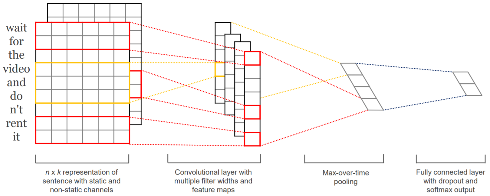
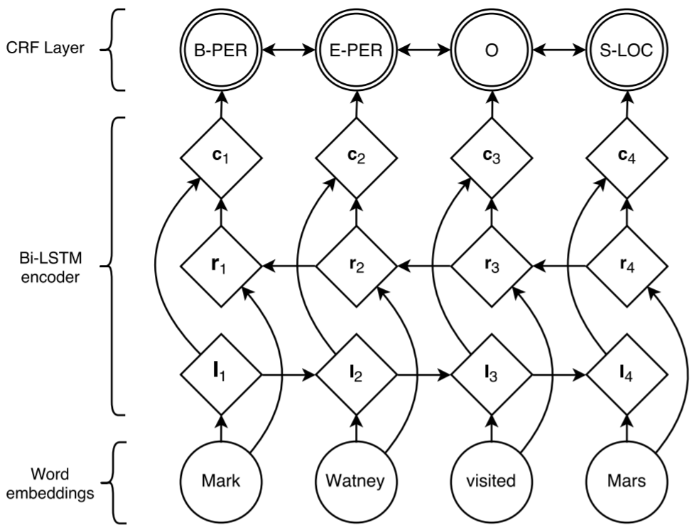
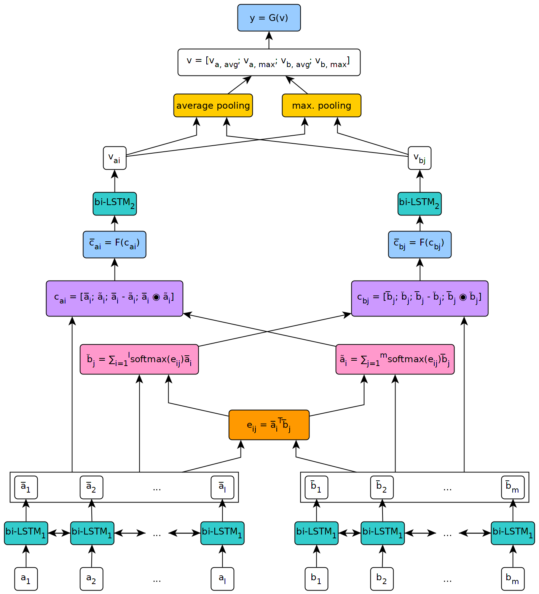
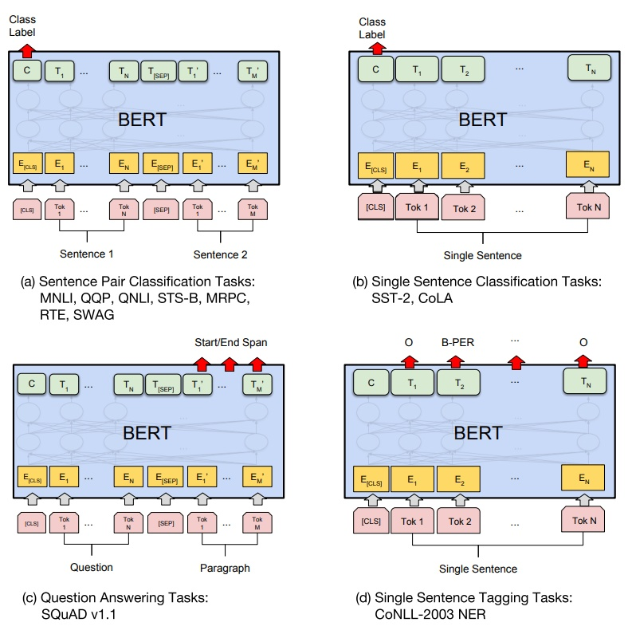

写在前面：

1. 全体新加入实验室的同学，需要完成以下四个任务，每个任务大约会给三到四周左右的时间；
2. 在模型写完并完成训练后，请联系程序练习负责人获取测试集，然后用自己训好的模型推断获得结果，处理成要求的格式，命名为result.txt，发给负责人，负责人会计算测试结果；
3. 最后将全部代码+README.md说明文件打包成以自己学号命名的压缩包发给负责人；
4. 前三个任务可以参考开源代码，但是最后提交的代码必须是自己写的；
5. 禁止使用除了训练集以外的任何数据用于训练，禁止使用验证集、测试集进行训练。

## 提交情况（不断更新中）

序号按照首次提交的时间排列。

#### 文本分类：

| 序号 | 学号       | 准确率 | 最终提交时间      | 说明  |
| ---- | ----------| ------ | -------------|------|
| 1    | 20120376  | 90.88% | 2020年10月09日||
| 2    | 20125222  | 89.68% | 2020年10月11日||
| 3    | 20120419  | 90.10% | 2020年10月08日||
| 4    | 20125185  | 90.16% | 2020年10月10日||
| 5    | 20125265  | 88.84% | 2020年10月10日||
| 6    | 20120374  | 91.06% | 2020年10月10日|添加了一层额外的BiLSTM|
| 7    | 20125197  | 87.77% | 2020年10月10日|使用了word2vec训练的词向量|
| 8    | 20120447  | 89.60% | 2020年10月11日||
| 9    | 20125261  | 85.12% | 2020年10月11日||
| 10    | 20140105  | 85.35% | 2020年10月15日||
| 11    | 20125196  | 88.01% | 2020年11月24日||
| 12    | 20125231  | 87.50% | 2020年11月30日||

#### 序列标注：

| 序号 | 学号       | F1值 | 最终提交时间      | 说明  |
| ---- | ----------| ------ | -------------|------|
| 1    | 20120419  | 88.85% | 2020年10月16日||
| 2    | 20120376  | 84.35% | 2020年10月18日||
| 3    | 20125222  | 76.86% | 2020年10月19日||
| 4    | 20120374  | 77.44% | 2020年10月29日||
| 5    | 20125265  | 70.36% | 2020年11月04日||
| 6    | 20125185  | 77.39% | 2020年11月04日||
| 7    | 20140105  | 74.72% | 2020年12月01日||

#### 文本蕴含：

| 序号 | 学号       | 准确率 | 最终提交时间      | 说明  |
| ---- | ----------| ------ | -------------|------|
| 1    | 20120419  | 83.62% | 2020年10月30日|直接使用测试集作为验证集|
| 2    | 20125222  | 76.17% | 2020年10月31日||
| 3    | 20120376  | 82.16% | 2020年11月09日|直接使用测试集作为验证集，且未去除标签为'-'的句对|
| 4    | 20125185  | 81.19% | 2021年01月07日||
| 5    | 20125265  | 84.41% | 2021年01月08日||

#### 预训练模型：
##### 文本分类：

| 序号 | 学号       | 准确率 | 最终提交时间      | 说明  |
| ---- | ----------| ------ | -------------|------|
| 1    | 20120419  | 93.89% | 2020年10月27日|参考的BERT-ITPT但是没用ITPT|
| 2    | 20125222  | 92.69% | 2020年11月01日||
| 3    | 20120376  | 93.75% | 2020年11月16日||
| 4    | 20125185  | 93.07% | 2021年01月13日||

### 任务一：基于TextCNN的文本分类

数据集：[Large Movie Review Dataset](http://ai.stanford.edu/~amaas/data/sentiment/) 

参考论文：Convolutional Neural Networks for Sentence Classification，https://arxiv.org/abs/1408.5882

模型图：

 

需要了解的知识点：

1. 文本特征表示：词向量
   1. 对word embedding随机初始化
   2. 用glove预训练的embedding进行初始化 https://nlp.stanford.edu/projects/glove/
2. CNN如何提取文本的特征

说明：

1. 训练集25000句，测试集25000句，需要自己写脚本合在一起；
2. 请将训练集用于训练，测试集用于验证，最后我会再给你一个测试集；
2. 测试结果格式：每行对应一句话的分类结果；

当前的SOTA排名：https://github.com/sebastianruder/NLP-progress/blob/master/english/sentiment_analysis.md

### 任务二：基于BiLSTM+CRF的序列标注

用BiLSTM+CRF来训练序列标注模型，以Named Entity Recognition为例。如果CRF你搞不明白，那就只用BiLSTM也行。

数据集：CONLL 2003，https://www.clips.uantwerpen.be/conll2003/ner/

参考论文：Neural Architectures for Named Entity Recognition，<https://arxiv.org/pdf/1603.01360.pdf> 

模型图：

 

需要了解的知识点：

1. RNN如何提取文本的特征
2. 评价指标：precision、recall、F1
3. CRF比较复杂，不理解没关系

说明：

1. 训练集、验证集、测试集已经分割好了，但是你仅使用训练集和验证集即可，最后我会再给你一个测试集；
2. 如果数据下不下来，这个目录里有现成的数据：https://github.com/yuanxiaosc/BERT-for-Sequence-Labeling-and-Text-Classification ；
3. 测试结果格式：每行对应一句话的标注结果，词之间用空格相分隔；

当前的SOTA排名：https://github.com/sebastianruder/NLP-progress/blob/master/english/named_entity_recognition.md

### 任务三：基于ESIM的文本匹配

输入两个句子，判断它们之间的关系。参考ESIM（可以只用LSTM，忽略Tree-LSTM），用双向的注意力机制实现。

数据集：https://nlp.stanford.edu/projects/snli/

参考论文：Enhanced LSTM for Natural Language Inference，<https://arxiv.org/pdf/1609.06038v3.pdf>

模型图：

 

知识点：

1. 注意力机制在NLP中的应用

说明：

1. 训练集、验证集、测试集已经分割好了，但是你仅使用训练集和验证集即可，最后我会再给你一个测试集；
2. 测试结果格式：每行对应一个句对的匹配结果；

当前的SOTA排名：https://nlp.stanford.edu/projects/snli/

### 任务四：基于Bert的自然语言理解

Bert可以用来进行分类、标注、匹配等多种自然语言理解任务。这里需要用Bert重新实现上述三个任务中的任意一个。（难度：任务一 < 任务三 < 任务二）

建议使用的框架：Huggingface，https://github.com/huggingface/transformers

参考论文：BERT: Pre-training of Deep Bidirectional Transformers for Language Understanding，https://arxiv.org/abs/1810.04805

模型图：

 

知识点：

1. 预训练和预训练模型
2. 子词切分
3. 自注意力和transformer（不过不需要你自己写模型）
